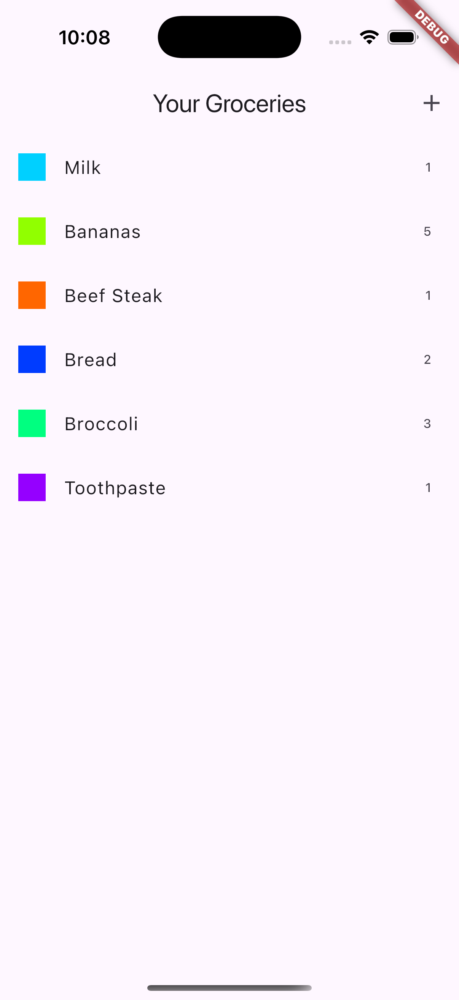
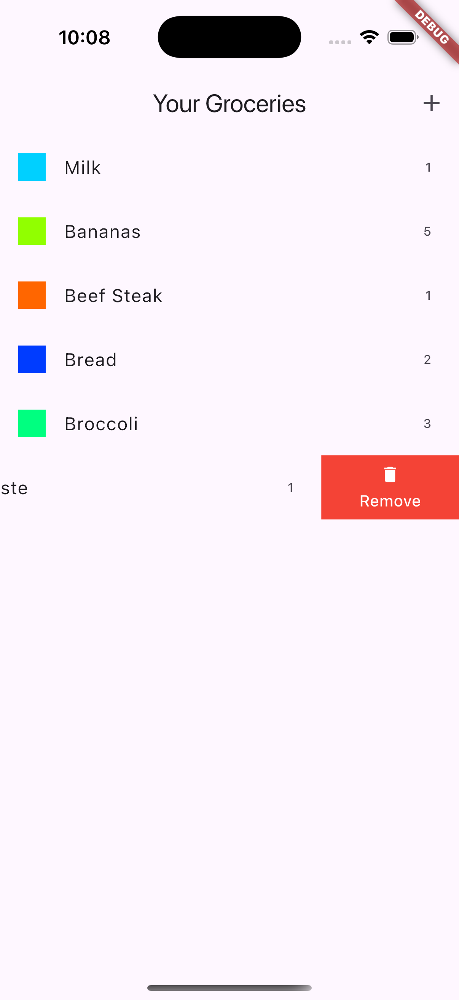
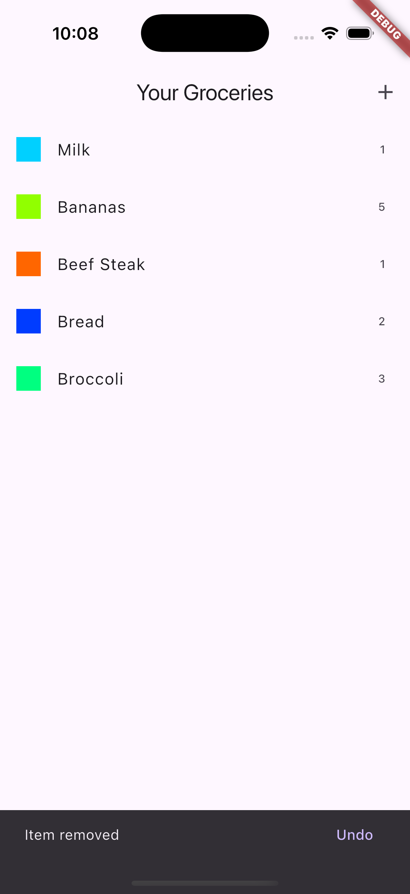

# app_groceries

Grocery List application to show a list of groceries and to add and remove a grocery item.   Removing a grocery item using the flutter_slidable package to show how Remove can be performed, Undo is shown in the Snackbar.    Adding a new item shows how a category drop down can be used in a add item form and a reset.

## Getting Started

###  Grocery List

### Remove grocery

### SnackBar Undo Remove

### Add Expense

